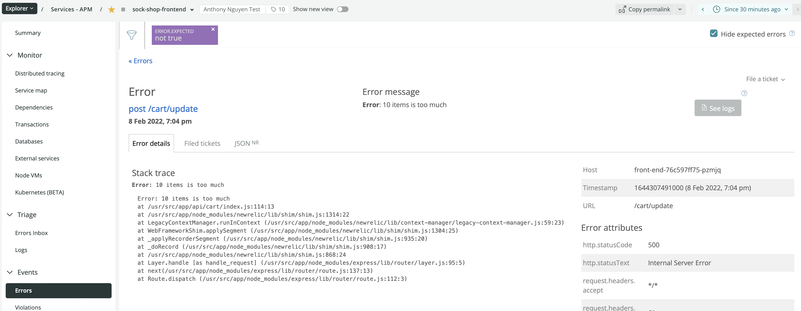
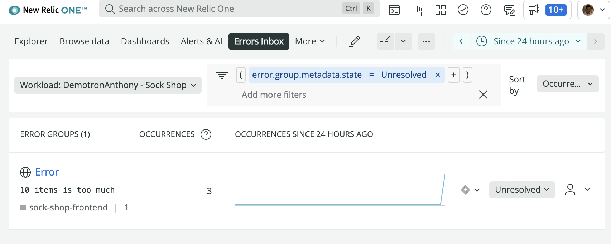
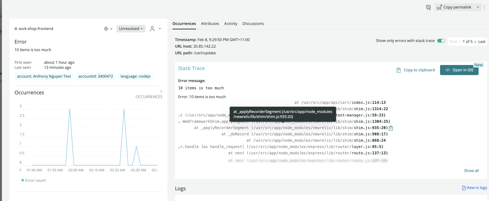
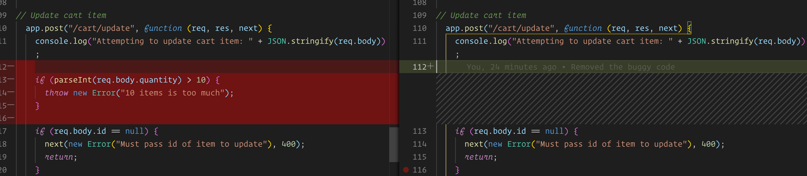
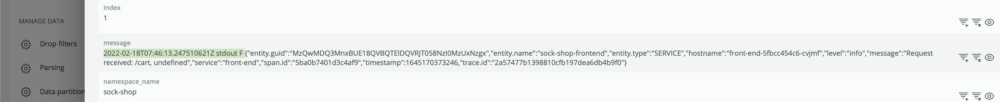
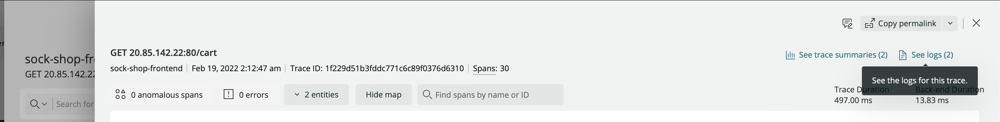
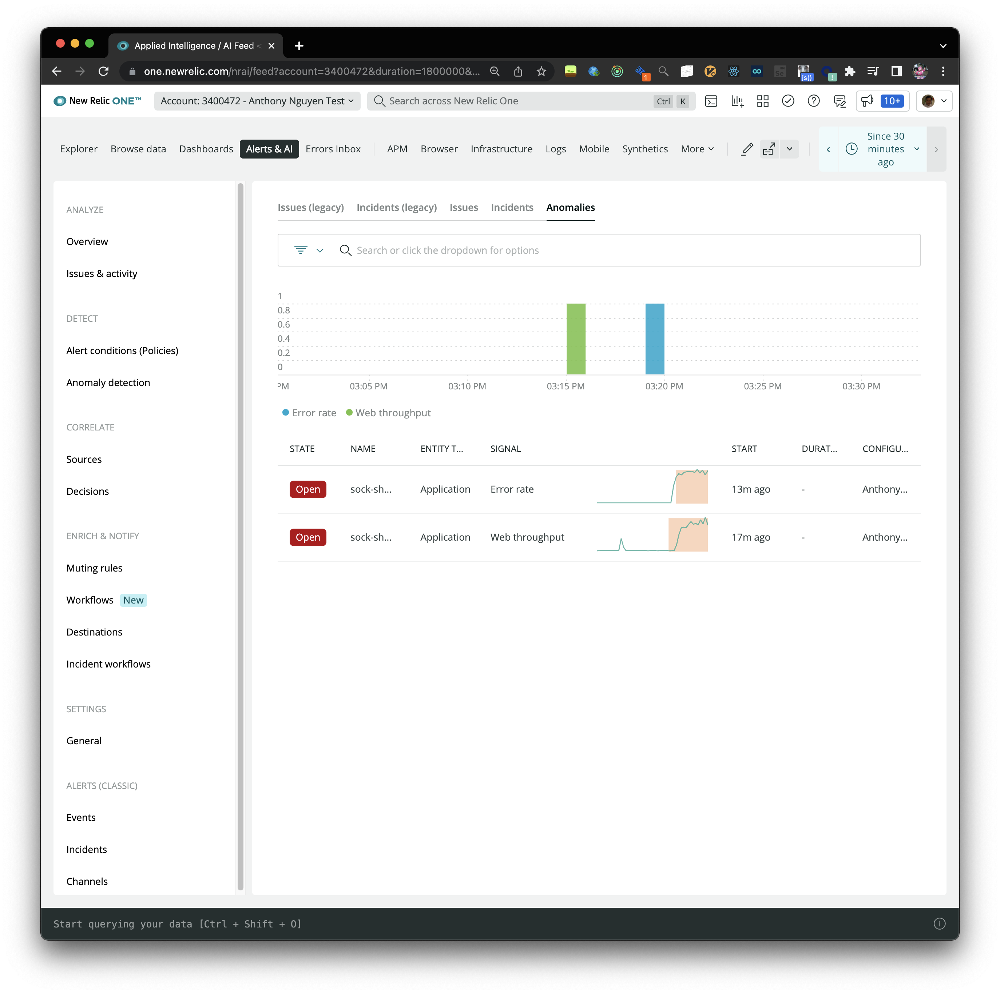
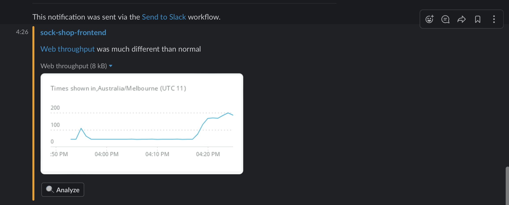
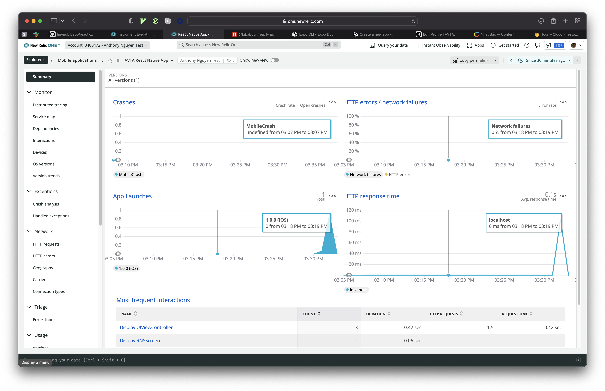

# Create your own New Relic demo environment using AWS or Azure K8s cluster

-   This tutorial will walk you through the process on how you can fully observe a complex, multi-language microservice based E-Commerce application running in a Kubernetes cluster using [https://pixielabs.ai](https://pixielabs.ai) and New Relic
-   This walkthought will cover the following features of New Relic One Platform:
    -   Create new Kubernetes cluster using either Azure AKS or AWS EKS
    -   Deploy a typical [Microservice E-Commerce](https://github.com/microservices-demo/microservices-demo/blob/master/internal-docs/design.md) Kubernetes application to your cluster
    -   Start observing your kubernetes application with Pixie without instrumentation
    -   Enable Distributed Tracing with New Relic APM
    -   Monitor Real User Experience using Browser Monitoring
    -   Pull custom K8s metrics into New Relic Database using Pixie Script and New Relic Flex
    -   View application Errors in New Relic Errors Inbox
    -   Jump straight to the line of code in VSCode using New Relic CodeStream Integration
    -   Add Logs In Context
    -   Monitor React Native Mobile application
    -   Configure Automatic Anomaly Detection
    -   Configure Alerts and AI and reduce noise

## Prerequisites

-   Azure or AWS Cloud account
-   A new New Relic account [sign up here](https://newrelic.com/signup)
-   Docker desktop [link](https://docs.docker.com/get-docker/)
-   Docker Hub account [sign up here](https://hub.docker.com/signup)
-   Github account [sign up here](https://github.com/join)
-   Kubectl, helm3, nodejs, git, Azure or AWS cli installed
-   K6 load test tool [link](https://k6.io/docs/getting-started/installation/)
-   VScode [downloa here](https://code.visualstudio.com/download)
-   Basic Bash knowledge since all commands are Bash commands
-   Clone this repo to your local machine

## Create fully managed Kubernetes cluster in AWS or Azure

### Create EKS Cluster in AWS

```bash
# install aws cli at https://docs.aws.amazon.com/cli/latest/userguide/getting-started-install.html
# login
aws configure

# install eksctl https://docs.aws.amazon.com/eks/latest/userguide/eksctl.html
# create new Managed nodes cluster (not the Fargate), this will create 2 nodes cluster (m5.larger)
eksctl create cluster --name pixiecluster --region us-east-1

# install kubectl cli tool to your computer https://kubernetes.io/docs/tasks/tools/
# download correct kubeconfig
eksctl utils write-kubeconfig --cluster=pixiecluster

# confirm can connect to the cluster
kubectl get nodes -o wide
```

### Create Azure AKS cluster

```bash
# install azure cli at https://docs.microsoft.com/en-us/cli/azure/install-azure-cli
# login
az login

# if you have multiple subscriptions, select the right subscription
az account set -s SUBSCRIPTION_ID

# create resource group
az group create --name pixiedemo --location eastus

# create the K8s Cluster with 2 nodes WITHOUT monitoring. We need 2 in order to see 2 nodes in New Relic K8s Cluster Explorer
az aks create --resource-group pixiedemo --name pixiecluster --node-count 2 --enable-addons http_application_routing --generate-ssh-keys --enable-rbac

# install kubectl
az aks install-cli

# connect to the cluster via kubectl
az aks get-credentials --resource-group pixiedemo --name pixiecluster

# confirm can connect to the cluster
kubectl get nodes -o wide
```

## Deploy simple 2-Tier application (UI + Redis) on K8s Cluster and observe it using Pixie

-   First, let's deploy a very simple application and monitor it using New Relic and Pixie

```bash
# create simple Voting application
kubectl create namespace simplevote

kubectl apply -f apps/simple-vote.yaml --namespace=simplevote

# check external IP for the front end app and wait until the external-ip is on
kubectl get service simple-vote-front --watch --namespace=simplevote

# test to make sure you can access the html, you can also open this URL on browser
CURL http://<EXTERNAL-IP>

# install helm3 at https://helm.sh/docs/intro/install/
# login to newrelic one and follow guided install to add new k8s integration using heml3 command

# install using helm3
kubectl apply -f https://download.newrelic.com/install/kubernetes/pixie/latest/px.dev_viziers.yaml && \
kubectl apply -f https://download.newrelic.com/install/kubernetes/pixie/latest/olm_crd.yaml && \
helm repo add newrelic https://helm-charts.newrelic.com && helm repo update && \
kubectl create namespace newrelic ; helm upgrade --install newrelic-bundle newrelic/nri-bundle \
 --set global.licenseKey=LICENSE_KEY \
 --set global.cluster=pixiedemo \
 --namespace=newrelic \
 --set newrelic-infrastructure.privileged=true \
 --set global.lowDataMode=true \
 --set ksm.enabled=true \
 --set kubeEvents.enabled=true \
 --set prometheus.enabled=true \
 --set logging.enabled=true \
 --set newrelic-pixie.enabled=true \
 --set newrelic-pixie.apiKey=PIXIE_API_KEY \
 --set pixie-chart.enabled=true \
 --set pixie-chart.deployKey=PIXIE_DEPLOY_KEY \
 --set pixie-chart.clusterName=pixiedemo

# install k6 load test from https://k6.io
# run quick load test (replace EXTERNAL-IP with the correct external IP you get above)
k6 run -e PUBLIC_IP=<EXTERNAL-IP> loadtests/azure-vote.js

# go to http://one.newrelic.com, select Kubernetes
# click on Live debugging with Pixie and select "px/http_request_stats"
# you will see traffic going into the cluster
```

## Run Pixie CLI locally

```bash
# install pixie-cli
bash install-pixie-no-auth.sh

# login to NewRelic One UI, select Kubernetes, click on the cluster and select Live debugging with Pixie and click "Copy command"
# from the copied command, you will see your Pixie API Key
# run this command
px auth login --api_key='PIXIE_API_KEY'

# show the list of out the box script you can run
px scripts list

# run one of the scripts
# open http://<EXTERNAL-IP> and click on Dogs or Cats then run this command
px run px/redis_data

```

## Setup E-Commerce Microservice application to your K8s Cluster

-   Next, let's deploy this [e-commerce microservice application](https://github.com/microservices-demo/microservices-demo/blob/master/internal-docs/design.md) to the cluster

```bash
# create new namespace
kubectl create namespace sock-shop

kubectl apply -f "https://raw.githubusercontent.com/microservices-demo/microservices-demo/master/deploy/kubernetes/complete-demo.yaml" --namespace=sock-shop

# change service type from NodePort to LoadBalancer so that we can access it from outside
kubectl patch svc front-end -p '{"spec": {"type": "LoadBalancer"}}' -n sock-shop

# get the external IP of the front-end service
kubectl get service --watch --namespace=sock-shop

# make sure all containers are running properly
kubectl get pod --namespace=sock-shop

# make sure the frontend is now accessible
curl http://<EXTERNAL-IP>

# open http://<EXTERNAL-IP> and play around with the app (sign up for user, add to cart, checkout, etc..)

# run load test against this new Website
k6 run -e PUBLIC_IP=<EXTERNAL-IP> loadtests/sock-shop.js

# go to New Relic One, select Kubernetes and click on Live debugging with Pixie and select "px/http_request_stats"
# you will see traffic going into the cluster

# run a custom Pixie script to see the MongoDB connections
px run -f get_connections_to_mongodb.py
```

## Add APM to a NodeJs Service and enable distributed tracing

-   Right now, we don't have Distributed Tracing for the sock-shop application. This is because Pixie can only inspect HTTP traffic but cannot modify them. For Distributed Tracing to work, we will need to inject custom `traceid` header to every HTTP requests
-   This is why under `Services - APM` you wouldn't see any entries belong to the sock-shop
-   In this step, we will add New Relic APM agent to the front end of the sock-shop

```bash
# make sure you have an account with hub.docker.com and have docker desktop installed on your machine and authenticated
# go to https://github.com/microservices-demo/front-end and fork this repo (you don't want to modify this repo directly)
mkdir sock-shop
cd sock-shop

# clone the front-end app
git clone https://github.com/<YOUR_GITHUB_USER>/front-end.git
cd front-end

# modify Dockerfile and change from 'FROM node:10-alpine' to 'FROM node:12-alpine' since our latest newrelic npm packaged does not support Node 10
# build new docker image
docker build . -t <YOUR_DOCKER_ACCOUNT>/sock-shop-frontend:v1

# if you're on Apple M1 macbook, then you will need to build amd64 version like this
# docker buildx build --platform linux/amd64 . -t <YOUR_DOCKER_ACCOUNT>/sock-shop-frontend:v1
docker push <YOUR_DOCKER_ACCOUNT>/sock-shop-frontend:v1

# update the image of the runing front-end deployment
kubectl set image deployment/front-end front-end=<YOUR_DOCKER_ACCOUNT>/sock-shop-frontend:v1 -n sock-shop

# make sure URL still working
curl http://<EXTERNAL-IP>

# to Add Node Js APM Agent:
# from inside front-end folder, install NR nodejs APM agent
# IMPORTANT: modify the Dockerfile and change FROM node:10-alpine to FROM node:12-alpine
# IMPORTANT: modify server.js and add require("newrelic") to first line

cd sock-shop/front-end
npm install newrelic

# build and push new image containing APM Agent
docker build . -t <YOUR_DOCKER_ACCOUNT>/sock-shop-frontend:apm
docker push <YOUR_DOCKER_ACCOUNT>/sock-shop-frontend:apm

# set required New Relic environment variables

kubectl set env deployment/front-end \
    NEW_RELIC_LICENSE_KEY=YOUR_NR_INGEST_API \
    NEW_RELIC_APP_NAME=sock-shop-frontend \
    NEW_RELIC_NO_CONFIG_FILE=true \
    NEW_RELIC_DISTRIBUTED_TRACING_ENABLED=true \
    --namespace=sock-shop

kubectl set image deployment/front-end front-end=YOUR_DOCKER_ACCOUNT/sock-shop-frontend:apm -n sock-shop

# manually navigate to the app via browser, click through some pages
# go back to NR1, click on APM, you should see new app in the list
```

## Add Browser monitoring

-   Now that we have APM agent installed for our backend services, let's monitor Real User experience by enabling Browser Integration

```bash
# go to New Relic One, select `Add more data` and select Browser and select 'Copy/Paste Javascript code'
# select 'sock-shop-frontend' from the list of apps

# edit /sock-shop/front-end/public/js/front.js file and paste the content of the <script type="text/javascript"> tag in it (NOT including <script type="text/javascript"> itself since this is not Javascript)

# build and push new front-end docker image
cd sock-shop/front-end
docker build . -t <YOUR_DOCKER_ACCOUNT>/sock-shop-frontend:rum
docker push <YOUR_DOCKER_ACCOUNT>/sock-shop-frontend:rum

# update the image of front-ent app
kubectl set image deployment/front-end front-end=YOUR_DOCKER_ACCOUNT/sock-shop-frontend:rum -n sock-shop

# manually navigate to the app via browser, click through some pages
# go back to NR1, click on Browsers app, you should see new app in the list
```

## Install New Relic Infrastructure Agent + Flex on K8s and push Pixie data to NRDB

-   Currently, for security reasons, when [Pixie](https://pixielabs.ai) is installed into your k8s cluster, New Relic only fetches and stores data that related to an application's performance. Therefore, you can only create Alert and Dashboard on a predefined subset of the data collected by Pixie [read more here](https://docs.newrelic.com/docs/kubernetes-pixie/auto-telemetry-pixie/pixie-data-security-overview/).
-   However, with New Relic Infrastructure Agent and Pixie CLI installed in your K8s cluster, you can write custom Pixie script and periodically push Pixie metrics to New Relic Database and then create dashboard and alerts on these metrics

```bash
# first, let's build and push new New Relic Infrastructure agent image with Pixie cli installed

# inspect `Dockerfile` file in the root of this repo
docker build . -t <YOUR_DOCKER_ACCOUNT>/newrelic_infrastructure_with_pixie:latest

docker push <YOUR_DOCKER_ACCOUNT>/newrelic_infrastructure_with_pixie:latest

# store NR Ingest and PIXIE API key in k8s secret
# you can get PIXIE API by click on `Copy command` link under `Live debugging with Pixie` tab on New Relic Kubernetes Cluster Explorer page
echo -n 'YOUR_PIXIE_API_KEY' > ./pixieapikey
echo -n 'YOUR_NR_INGEST_API' > ./nringestapi

# assuming your kubectl config file is at default location: $HOME/.kube/config
kubectl create secret generic pixiesecrets --from-file=./pixieapikey --from-file=./nringestapi --from-file=$HOME/.kube/config

# edit nri-flex.yml file and update line 23, updating YOUR_DOCKER_ACCOUNT
# deploy the change
kubectl apply -f nri-flex.yml

# go back to the sock shop app and click around
# After couple minutes, you can query the data in New Relic like this
```


## Introduce some error code and see Errors in New Relic

-   Right now the app is working perfectly, so there is no error
-   To introduce some error, let's modify `/front-end/api/cart/index.js` file and add the following

```javascript
app.post("/cart/update", function (req, res, next) {
    console.log("Attempting to update cart item: " + JSON.stringify(req.body));

    // throw an error when quantity is greater than 10
    if (parseInt(req.body.quantity) > 10) {
      throw new Error("10 items is too much");
    }

    // rest of the file..
```

-   Since our ExpressJS has Error handler middleware, all exceptions are handled and because New Relic only reports unhandled exceptions, we will need to manually report exceptions to New Relic by modifying `/front-end/helpers/index.js` file

```javascript
// initialize newrelic
var newrelic = require('newrelic');

helpers.errorHandler = function (err, req, res, next) {
	var ret = {
		message: err.message,
		error: err,
	};

	// send error directly to NewRelic
	newrelic.noticeError(err);
	res.status(err.status || 500).send(ret);
};

// rest of the file...
```

-   Build and deploy the new image

```bash
cd front-end
docker build . -t <YOUR_DOCKER_ACCOUNT>/sock-shop-frontend:error
docker push <YOUR_DOCKER_ACCOUNT>/sock-shop-frontend:error

# use the newly built image
kubectl set image deployment/front-end front-end=YOUR_DOCKER_ACCOUNT/sock-shop-frontend:error -n sock-shop

# go to the app on browser, add an item into the cart and then update the cart
# - set the quantity to 10 => works fine
# - set the quantity to 11 => get 500 server (you can see error in the network tab in browser Dev Tools)
# go to NR, select 'sock-shop-frontend' under APM, you should see some error reported under Events > Errors
```

-   Click on error will show stack trace
    

## Add workload and view Errors inbox

-   To use Errors Inbox, we will need to create a workload first
-   Go to New Relic One, select Workloads, then create new Workload
-   Select `sock-shop-frontend` app from APM
-   Go to Errors Inbox, select your new workload from the workload dropdown
-   You will see error in your Error inbox



## Install CodeStream to VSCode and view Errors inside the IDE

-   If you're a developer and you have Core User or Full License, you can view Errors directly in your IDE
-   Install Vscode CodeStream extension and Sign up for a Code Stream account directly inside VSCode
-   Select "Connect to New Relic One" and connect to New Relic using User API Key, you can get your User Api key by login to New Relic One, select API Keys from your profile drop down menu
-   Create tag v0.0.1 and get current commit SHA from the front-end repository

```bash
# get the current commit SHA from the front-end repository
cd sock-shop/front-end
git log -1 --format="%H"

# from the root of this repo, apply changes

kubectl set env deployment/front-end \
    NEW_RELIC_METADATA_REPOSITORY_URL=https://github.com/<YOUR_GITHUB_USER>/front-end.git \
    NEW_RELIC_METADATA_COMMIT=<COMMIT_ID> \
    --namespace=sock-shop

kubectl set image deployment/front-end front-end=YOUR_DOCKER_ACCOUNT/sock-shop-frontend:error5 -n sock-shop

# go back to the sock shop and reproduce the error again (update cart to 11 items)
# go back to Errors Inbox, click on the latest error
# click on 'Open in IDE', you should see VScode open at the right location, in read-only mode
```




-   Note: even when the code is changed, because CodeStream has the git SHA, Code Stream will still be able to show you the line of code from the stack trace
-   Let's demonstrate this by removing the lines of code we added earlier, like this



-   Click on `Open In IDE` again, you will see that VScode is displaying the previous version


## Add Logs in Context for the front-end app

-   Right now the front-end nodejs app is not using any structure logging, only `console.log` is used
-   Let's add `winston` structured logging to it

```bash
# install winston and newrelic winston enricher
npm i --save winston @newrelic/winston-enricher
```

-   Add windston logger by modifying the `helpers/index.js` file

```javascript
'use strict';

var request = require('request');
var newrelic = require('newrelic');
var helpers = {};

const winston = require('winston');
const newrelicFormatter = require('@newrelic/winston-enricher');
helpers.logger = winston.createLogger({
	level: 'info',
	format: winston.format.combine(
		winston.format.json(),
		// combine with newrelic enricher
		newrelicFormatter()
	),
	defaultMeta: { service: 'front-end' },
	transports: [
		// just push to console this will be picked up by Newrlic logger FluentBit daemon
		new winston.transports.Console(),
	],
});

// remaining of the file
```

-   overwrite `console.log` globally with Winston `logger.info` in `server.js` file

```javascript
const { logger } = helpers;
// overrwrite global console.log object
global.console.log = (...args) => logger.info.call(logger, ...args);

// remaining of the file
```

-   Redeploy the app again (follow above instructions) (build new image, push, update deployment etc.)
-   Reload the browser and go to New Relic One, you will see something like this



-   The reason for this is because both EKS and AKS changed container runtime from docker to contianerd and since then the log format is now changed and we're unable to process the nested structured logs correctly. When we install [newrelic-bundle](https://artifacthub.io/packages/helm/newrelic/nri-bundle) helm chart in step 1, default `fluentBit.criEnabled` configuration for [newrelic-logging](https://github.com/newrelic/helm-charts/tree/master/charts/newrelic-logging) is false, we need to change this to true

```bash
# update LOG_PARSER env to cri
kubectl set env DaemonSet/newrelic-bundle-newrelic-logging LOG_PARSER=cri --namespace=newrelic

# force daemonset restart
kubectl rollout restart DaemonSet newrelic-bundle-newrelic-logging -n newrelic
```

-   Reload the browser and go to New Relic One, Logs In Context should now be working



## Set up Automatic Anomalies Detection

-   Login to New Relic, and select `Alerts and AI` tab
-   Select `Anomaly Detection`
-   Select `Add a configuration` under `Automatic`
-   Enter name `Sock shop Anomalies Detection`, select your account and select all APM applications
-   Select how you want to receive Anomalies alerts and click on `Save configuration` (e.g Slack or Webhook)
-   Run the load test again

```bash

k6 run -e PUBLIC_IP=<EXTERNAL-IP> loadtests/sock-shop.js

```

-   Go to New Relic > Alerts and AI and select Issues & activity and click on Anomalies
-   You will see something like this



-   In your Slack Channel, you will see something like this



## Create Alerts and Workflow

-   Login to New Relic, and select `Alerts and AI` tab
-   Select `Alert conditions (Policies)`
-   Create new policy called `Sock Shop Alert` with 2 conditions:
    -   When any target application's Web transaction time average deviates from the baseline for at least 5 minutes
    -   When target application Error % > 5% for at least 5 minutes
    -   Select `Connect to Incident Intelligence`
-   Select `Workflows (New)` tab and click on `Add a workflow`
-   Give it a name, select `Send all issues`
-   Select your preferred notification channel and click on `Activate workflow`
-   Run the load test again

```bash

k6 run -e PUBLIC_IP=<EXTERNAL-IP> loadtests/sock-shop.js

```

-   While the load test is running, go back to NR1, and select `Alerts and AI > Issues & activity > Incidents` to see 2 incidents created by NR1
-   Click on `Issues` tab to see one opened Issue with 2 related incidents

## Add React Native Mobile app

If you have a React Native Mobile app, you can also monitor it using New Relic

## Create a new expo app

```bash

# install Expo cli
npm install --global expo-cli

# create new expo app, select `tabs (Typescript)` template when asked
expo init weavesock-shop-mobile

# make sure you can run the app (you should see Iphone 8 simulator open showing the app)
cd weavesock-shop-mobile
npm run ios

# run expo prebuild command
expo prebuild --clean

```

## Install NewRelic Mobile Agent

-   modify the `Podfile` founder under the `ios` folder and add `pod 'NewRelicAgent'` to the first line

```bash
# from inside the ios folder
cd ios
pod install
# you should see `Installing NewRelicAgent (7.3.4)` message
```

## Register your mobile app to New Relic One

-   Login to one.newrelic.com, click on `Add More Data`, search for Mobile, select XCFramework
-   On the next screen, enter name for your app
-   Select `CocoaPods` as installation method
-   Scroll to step 4 and copy this line
-   `[NewRelic startWithApplicationToken:@"YOUR_UNIQUE_TOKEN"];`
-   Modify `AppDelegate.m` file founder under the `ios\weavesock-shop-mobile` folder and add the following to line 2

```h
#import "AppDelegate.h"
// line 2
#import <NewRelic/NewRelic.h>
```

-   Modify `AppDelegate.m` file founder under the `ios\weavesock-shop-mobile` folder and add the following to `didFinishLaunchingWithOptions` method

```h
@implementation AppDelegate

- (BOOL)application:(UIApplication *)application didFinishLaunchingWithOptions:(NSDictionary *)launchOptions
{
  [NewRelic startWithApplicationToken:@"YOUR_UNIQUE_TOKEN"];
```

-   open XCode by running the following command

```bash
cd ios
open weavesock-shop-mobile.xcworkspace
```

-   In XCode, select your project in the navigator, then click on the application target.
-   Select Build Phases, then add a New Run Script Build Phase
-   In the script text area (beneath the Shell line) enter this script:

```bash
SCRIPT=`/usr/bin/find "${SRCROOT}" -name newrelic_postbuild.sh | head -n 1`

/bin/sh "${SCRIPT}" "YOUR_UNIQUE_TOKEN"
```

-   run your project again

```bash
# from the root folder (parent folder of ios folder)
npm run ios
```

-   open one.newrelic.com, you should see your app under `Explorer/Mobile applications`
    

# Clean up your Resources

```bash
# delete the Azure AKS cluster
az aks delete --name pixiecluster --resource-group pixiedemo

# delete the AWS EKS cluster
eksctl delete cluster --name pixiecluster --region us-east-1
```
