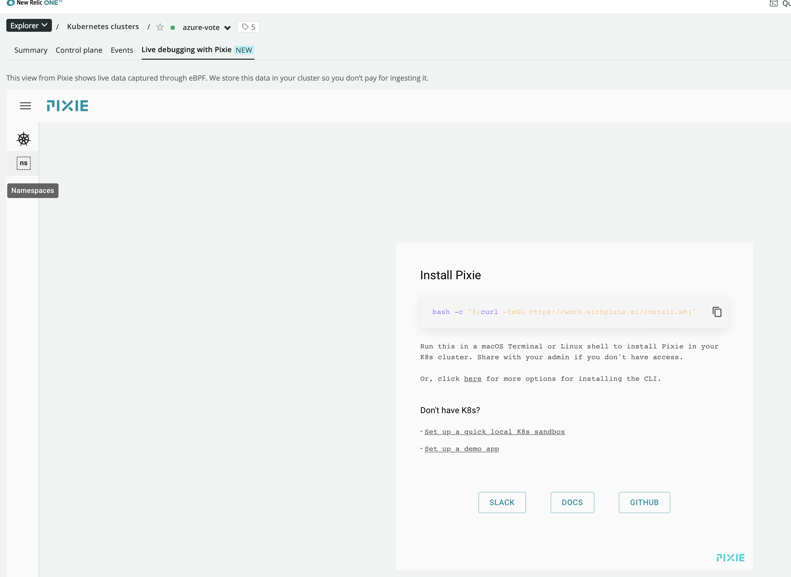
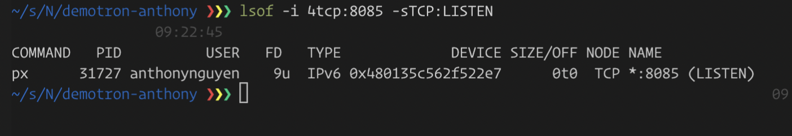
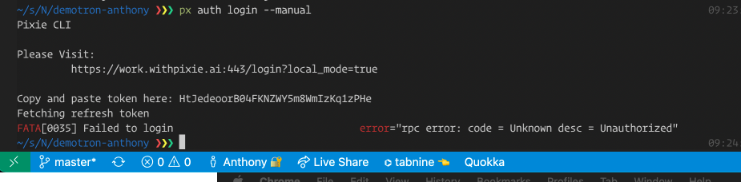

# New Relic Demo environment setup on Azure

## Setup a simple 2 Tier application (UI + Redis) on AKS
```bash
# create resource group
az group create --name newrelicdemotron --location eastus

# check to make sure that Microsoft.OperationsManagement is enabled
az provider show -n Microsoft.OperationsManagement -o table
az provider show -n Microsoft.OperationalInsights -o table

# enable if not already enabled
az provider register --namespace Microsoft.OperationsManagement
az provider register --namespace Microsoft.OperationalInsights

# create the K8s Cluster
az aks create --resource-group newrelicdemotron --name myAKSCluster --node-count 1 --enable-addons monitoring,http_application_routing --generate-ssh-keys --enable-rbac

# check and increase the number of nodes on the cluster
az aks show --resource-group newrelicdemotron --name myAKSCluster --query agentPoolProfiles
az aks nodepool update --min-count 1 --max-count 5 -g newrelicdemotron -n nodepool1 --cluster-name myAKSCluster --enable-cluster-autoscaler

# connect to the cluster via kubectl
az aks install-cli
az aks get-credentials --resource-group newrelicdemotron --name myAKSCluster

# confirm can connect to the cluster
kubectl get nodes

# create the application
kubectl apply -f apps/azure-vote.yaml

# check external IP for the front end app and wait until the external-ip is on
kubectl get service azure-vote-front --watch

# test to make sure you can access the html
CURL http://20.81.7.29

# install NR1 (go to NR1, add more data, search for Kubernetes and follow the instructions and download the manifest file
kubectl apply -f https://download.newrelic.com/install/kubernetes/pixie/latest/px.dev_viziers.yaml
kubectl apply -f https://download.newrelic.com/install/kubernetes/pixie/latest/olm_crd.yaml
kubectl create namespace newrelic
kubectl apply -f <PATH_TO_DOWNLOADED_FILE>

# install k6 load test from https://k6.io and run quick load test
# NOTE: update the ipaddress of the host in the simple.js file first
k6 run loadtests/simple.js

# make sure you can see traffic coming into the cluster
```

## Setup pixie

Issues: Pixie is not installed eventhough I selected during the setup process


Port 8085 is open


Tried login manually still doesn't work

